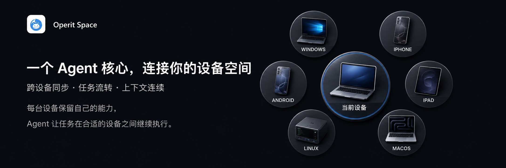

<div align="center">
  
  <h1>Operit2</h1>
  <p>一个 Agent 核心，连接你的设备空间。</p>
  <p><strong>预览版本</strong> · <a href="docs/Operit2技术白皮书.pdf">阅读技术白皮书</a></p>
</div>

<p align="center">
  
</p>

Operit2 是面向个人用户的跨设备 Agent Core。每台设备运行一个 `CoreNode`，保留本地 Host 和系统权限；`Space` 负责同步持久化状态，`Binding` 决定任务下一步在哪个节点继续。

项目源于 Operit 的 Android Agent 实践，当前正在把手机、桌面、浏览器和 Linux 云端设备连接为一个个人设备空间。完整的项目起点、架构边界、任务连续性、权限模型、插件 SDK 和演进方向，请阅读 [Operit2 技术白皮书](docs/Operit2技术白皮书.pdf)。

> 预览阶段，底层结构、数据格式、插件契约和跨设备流程仍可能发生破坏性更新。

## 当前阶段已经形成的基础

### Rust Core 和模块边界

Operit2 已经形成以 Rust Core 为基础的 workspace。Core 业务、Host 契约、持久化、Provider、工具、插件、节点路由、访问控制和本地代理被拆成相对清晰的 crate 边界：

```text
foundation      Host API、共享模型、通用工具、Link 协议
persistence     本地数据、同步记录、Binding 和备份恢复
provider        远程 Provider、本地模型、聊天、STT/TTS 和市场服务
tool            工具执行、权限、Skill、Package、MCP 和脚本工具
plugin          ToolPkg、JavaScript、Wasm、Compose DSL 和 SDK
runtime         应用启动、聊天、工作区、事件和跨领域服务
node            CoreNode 路由、Binding、Space 和同步调度
access          身份、配对、认证、session、PeerLink 和发现
proxy           本地调用投影、Rust/Dart codegen 和 dispatch
application     Core 组合入口
command         CLI 命令层
```

目前部分领域仍然以 aggregate crate 形式存在，目录拆分和生命周期收敛还在继续。这里的边界首先是工程约束和演进方向，不意味着每个目标 crate 都已经完成最终拆分。

### CoreNode、Host、Space 和 Binding

Operit2 的执行模型尽量保持简单：

```text
CoreNode = OperitApplication + LocalCoreProxy + HostManager

Space    = 节点成员 + 已配对链路 + 持久化同步范围

Binding  = 某个任务下一步执行所对应的 CoreNode
```

它们分别表达不同的事情：

| 概念 | 作用 | 不代表什么 |
| --- | --- | --- |
| `CoreNode` | 一个设备或运行实例上的 Core 与本地 Host | 不是主节点、从节点或云端代理 |
| `Host` | 文件、终端、浏览器、网络、模型和系统权限等本地能力 | 不会因为加入 Space 自动共享 |
| `Space` | 组织成员、可达链路和持久化同步范围 | 不是执行容器、权限池或中心服务器 |
| `PeerLink` | 已配对节点之间的认证连接和数据载体 | 不会把中继节点伪装成目标节点 |
| `Binding` | 决定一次任务下一步由哪个节点继续 | 不搬迁数据，也不是进程热迁移 |
| `Identity` | 本地顶层隔离，拥有自己的数据和设备关系 | 不进入 Space 同步，也不通过 Link 传播 |
| Access Surface | Flutter、CLI/TUI、Web Access 等访问和呈现界面 | 不是另一套独立的业务 Core |

核心关系可以概括为：

```text
Flutter / CLI / TUI / Web Access
              │
              ▼
      LocalCoreProxy / local dispatch
              │
              ▼
  CoreNode = Core + 本地 Host + 持久化数据
              │
              ├── ordinary request -> 本地 Core
              ├── Binding request  -> CoreNodeRouter
              │                         │
              │                         └── PeerLink -> 其他 CoreNode
              │
              └── Space persistence sync -> 已声明的持久化数据
```

Space 内的节点地位对等。监听方、连接发起方和一次请求的执行方只是某次连接或调用中的角色，不会形成固定的主从关系。

### 持久化同步与实时流转

Operit2 把跨设备协作拆成两条相互配合、但不混为一谈的数据路径：

- 持久化同步路径负责聊天、配置、Binding、任务事实以及其他已声明数据的本地副本，让节点在断线、重启和迁移后仍有机会恢复工作。
- 实时路径负责 call、watch、push、事件、流和 Agent continuation，通过 `CoreNodeRouter` 和认证后的 `PeerLink` 把一次工作交给目标节点。

当前实现中的 `SpacePersistenceSyncService`、`CoreNodeRouter`、`PeerFrame`、MessagePack Link 编解码和生成的 route catalog，构成了这两条路径的主要工程基础。

本地应用调用链和 Space 节点链路也保持分离：Flutter/CLI 的本地调用进入生成的本地 Proxy；跨节点请求进入 Router 和 PeerLink，不重新伪装成应用层 Proxy 调用。

## 一项任务如何在设备间延续

Operit2 目前选择在“工具调用已经完成、工具结果已经持久化、下一轮模型请求尚未发起”的边界进行节点交接：

```text
1. 用户在手机或其他设备上发起对话。
2. 当前 CoreNode 运行模型和工具循环。
3. 工具调用结束，工具结果和相关任务事实先在本地提交。
4. Binding 通过比较写入选择下一步执行的目标 CoreNode。
5. 目标节点确认自己属于同一个 Space，并等待必要的同步状态。
6. 目标节点从已同步的上下文恢复下一轮模型请求。
7. 状态、结果和可恢复记录继续同步到其他成员节点。
```

这个边界让同一个任务在设备之间有清晰的执行归属，也避免多个节点同时推进同一轮模型请求。当前它不是下面这些能力：

- 正在运行的模型请求不会被原样搬到另一台设备；
- 终端 PTY、shell 进程、浏览器会话和 Host 句柄不会被热迁移；
- 所有实时细节不会无条件灌进同一个模型上下文；
- 改变 Binding 不等于把所有聊天、文件或 Agent 数据移动到目标节点。

这是一种任务意图和 continuation 的交接机制。长期目标是让用户在手机上发起、在云端持续执行、在桌面上查看和批准，并在合适的时机收到结果；当前优先保证边界清楚、状态可追踪和失败可恢复。

## 目前可以尝试的能力

### 单节点 Agent

每个 CoreNode 都可以独立运行自己的 Agent 工作流，具体能力取决于平台 Host、模型 Provider 和本地配置。当前仓库已经包含：

- 对话、会话分支、消息管理、附件、角色卡、角色群组和提示词配置；
- Provider 配置、模型参数、工具调用、请求队列和本地模型目录；
- 工作区、文件操作、项目模板、命令和备份/导入导出；
- 终端会话、PTY 输入和输出流；
- 网页访问、浏览器自动化、工作区浏览器和运行时 WebView 会话投影；
- 记忆、摘要、语音识别、语音合成以及其他内置工具。

这些能力并不在所有平台完全相同。真正能否执行某项操作，要看目标节点的 Host 描述、系统权限、已安装服务和当前用户批准。

### 多节点连接与 Space

CLI 已经提供配对、发现、连接、session、传输方式和 Space 成员管理入口；节点之间使用 Link Access 建立认证连接，再由 PeerLink 承载 Space 请求和同步流量。适合在本地或受控局域网环境中试验：

```powershell
operit2 cli link serve --bind <address:port> --token <strong-token>
operit2 cli link discover
operit2 cli link connect <url> --token <token> --save <session-name>
operit2 cli link space join <session-name>
operit2 cli link space show
```

命令参数以 `operit2 --help` 和 `operit2 cli` 的实际输出为准。不要使用默认开发 token 对公网监听，也不要把 token、私钥或真实业务数据放入公开日志和截图。

### 插件、Skill、ToolPkg 和 MCP

Operit2 的扩展面已经从“内置工具集合”逐步抽象为可管理的运行时与 SDK：

- 使用 JavaScript/TypeScript 编写 Package 和 ToolPkg；
- 使用 JavaScript bridge、Wasm runtime 和 Compose DSL 构建工具与界面；
- 使用 Skill 提供可导入、可见性可控的工作流和知识资源；
- 连接 MCP server，管理 MCP 配置、工具和本地 MCP 进程；
- 使用插件市场和包管理命令安装、启用、停用、查看和执行扩展；
- 通过 Rust SDK、TypeScript 声明和 codegen 为作者提供稳定的契约入口。

插件可以声明自己需要的运行时、Host capability、权限、兼容版本和状态范围。Operit2 不承诺一个插件无需声明就能在所有设备上运行；真正可靠的可移植性来自清晰的契约和可恢复的任务状态。

插件作者入口见 [`plugins/docs/README.md`](plugins/docs/README.md)，公共 SDK 说明见 [`core/crates/plugin/sdk/README.md`](core/crates/plugin/sdk/README.md)。

### Web Access

Web Access 是访问某个已运行 CoreNode 的浏览器访问面，不是默认独立的中心 Server。CLI 可以启动本地 Web Access 服务，Flutter Web 开发则使用隔离代理，以便启用本地 STT/TTS 和其他 WebAssembly 能力：

```powershell
# 终端一：apps/flutter/app
fvm flutter run -d web-server --web-hostname 127.0.0.1 --web-port 4835

# 终端二：仓库根目录
node tools/dev_web_access_proxy.mjs --upstream-port 4835 --listen-port 4836
```

随后打开 `http://127.0.0.1:4836`。代理会转发 Flutter Web 的 HTTP 和调试 WebSocket，并补充跨源隔离响应头；它只服务于本地开发，不是产品网关。

在 VS Code 中可以选择 `Operit2: Web (isolated)` 运行配置并按 F5。完整说明见 [`apps/web_access/README.md`](apps/web_access/README.md)。

### 数据备份与迁移

Operit2 把迁移视为个人设备连续性的一部分。CLI 已提供身份、存储路径、快照导出/恢复、备份检查以及 Operit 一代快照检查入口：

```powershell
operit2 cli identity list
operit2 cli storage paths
operit2 cli export snapshot <snapshot.zip>
operit2 cli backup inspect <snapshot.zip>
operit2 cli backup restore <snapshot.zip>
```

快照、配置和身份数据的具体范围以当前命令帮助和格式版本为准。活动中的进程和实时会话仍然属于原节点，不能把“有备份”理解成已经完成了所有运行时的无缝迁移。

## 平台与访问面

| 入口或平台 | 在当前架构中的位置 | 当前边界 |
| --- | --- | --- |
| Flutter App | 移动端和桌面端的主要图形访问面，也可以承载一个 CoreNode | Android、Windows、Linux、macOS、iOS、OpenHarmony 和 Web 的 Host/构建条件不同 |
| Rust CLI/TUI | 本地 CoreNode 和运维/开发入口 | 当前 CLI Host 主要覆盖 Windows、Linux 和 macOS |
| Web Access | 访问某个已运行 CoreNode 的浏览器入口 | 不是自动加入 Space 的浏览器节点，也不是中心化 Agent Server |
| WebAssembly/browser Host | 浏览器运行时的本地能力边界 | 与 Web Access 访问面分开，具体能力取决于浏览器和当前 Web 构建模式 |
| Linux 云端设备 | Space 中的普通 CoreNode | 长期在线可以承担更多任务，但不因此拥有中心身份 |
| Server | 未来的部署形态和 Host 方向 | 当前仓库还没有可以直接发布的完整 Server 产品 |

仓库包含多平台 Host 适配路径，但“能够构建”不等于“已经完成跨设备互操作验证”。平台构建、签名和发布条件请以 [`BUILDING.md`](BUILDING.md) 与对应 workflow 为准。

## 用户控制与安全边界

Operit2 采用从外到内逐层收紧的能力模型：

```text
0. App Runtime Sandbox
   虚拟机、容器、系统账号、Android 应用沙盒或服务器部署边界

1. Host Authorization
   操作系统真正授予本机 Host 的文件、终端、网络和系统能力

2. AI Capability Limit
   用户为 AI 选择的 ReadOnly、WorkspaceWrite 或 Full 能力模式

3. User Tool Approval
   用户对具体工具调用的允许、询问或禁止
```

几个必须保持的原则：

- Space 成员资格不会授予其他节点读取本机文件、使用本机终端或获得管理员/root 能力；
- API key、设备私钥、配对密钥、session 和本地平台权限默认属于节点本地，不会因为加入 Space 自动复制；
- `Full` 只表示 AI 能力限制放宽，不表示 Host 提权，也不能创造操作系统没有的能力；
- 应用内部的 sandbox 字段和 UI 不能冒充真实的操作系统级隔离边界；
- 对外监听 Link 或 Web Access 前，应使用强 token、受限监听地址、TLS/防火墙和脱敏日志；
- 用户始终拥有是否同步敏感数据、是否批准具体动作以及是否让节点参与协作的决定权。

完整边界说明见 [`docs/permission-access-architecture.md`](docs/permission-access-architecture.md) 和 [`hosts/README.md`](hosts/README.md)。

## 预览阶段的真实边界

### 已经可以作为工程基础使用

- Rust Core、Host API、LocalCoreProxy 和跨语言 codegen 已经形成基本工作链路；
- CoreNode、Space、Binding、Link Access、PeerLink 和持久化同步已有代码与架构约束；
- Flutter、CLI/TUI、Web Access、工作区、终端和浏览器能力已经有对应入口；
- ToolPkg、JavaScript/Wasm、Skill、MCP、Compose DSL 和插件 SDK 已形成扩展面；
- 身份隔离、快照、备份恢复和版本化方向已经进入工程路径。

### 正在打磨或仍需验证

- 跨设备任务流转的稳定性、取消、重连、背压、失败恢复和可观测性；
- 根据真实 Host capability、health、冗余和长期使用证据决定节点选择的调度机制；
- 节点数量增多后的发现、拓扑、路由、同步成本和个人用户可理解性；
- 插件在不同运行时、Host 和权限组合下的兼容声明与继续执行能力；
- 真正的应用内执行隔离边界；
- 可直接部署、长期运行和可迁移的 Server 产品形态。

### 当前不应该被理解成的承诺

- 所有设备拥有相同的硬件、模型和系统能力；
- 正在运行的模型、终端或浏览器会话可以被无缝热迁移；
- 任意插件、Skill 或 MCP server 可以自动在每个节点上运行；
- 已经支持数千节点的大规模调度；
- 已经提供面向企业团队、多租户或复杂组织治理的产品；
- Rust 本身就能证明没有内存泄漏、资源泄漏或长时间运行问题。

这些限制不是项目的终点，而是预览阶段需要诚实面对的工程问题。Operit2 会继续优先完善个人用户最在意的连续性、可恢复性、权限可见性和设备协作体验。

## 快速开始

### 环境要求

常用开发入口需要：

- Rust stable 和 rustup；
- Flutter SDK 与 FVM，用于 Flutter App；
- Node.js，用于 Web Access 开发代理；
- Python 3，用于构建、发布和辅助脚本；
- 对应平台的原生构建工具。

完整环境、签名、发布和平台差异见 [`BUILDING.md`](BUILDING.md)。不要把签名文件、API key 或发布 token 提交到仓库。

### CLI/TUI

从仓库根目录执行：

```powershell
cargo check --manifest-path apps/cli/Cargo.toml
cargo run --manifest-path apps/cli/Cargo.toml --bin operit2 -- --help
cargo run --manifest-path apps/cli/Cargo.toml --bin operit2 -- cli version
cargo run --manifest-path apps/cli/Cargo.toml --bin operit2 -- tui
```

没有参数时，`operit2` 默认进入 TUI。更多入口可以通过以下命令查看：

```powershell
cargo run --manifest-path apps/cli/Cargo.toml --bin operit2 -- cli
cargo run --manifest-path apps/cli/Cargo.toml --bin operit2 -- cli link
cargo run --manifest-path apps/cli/Cargo.toml --bin operit2 -- cli web
```

### Flutter App

从 `apps/flutter/app` 目录执行：

```powershell
fvm install --skip-pub-get
fvm dart pub get --enforce-lockfile
fvm flutter analyze
fvm flutter run -d windows
```

`windows` 只是示例设备名。Android、Linux、macOS、iOS、OpenHarmony 和浏览器模式需要各自的平台工具链，且 Host 能力并不相同。

### Web Access 开发

推荐使用仓库根目录的 VS Code 配置 `Operit2: Web (isolated)`，或者手动启动：

```powershell
# 终端一：apps/flutter/app
fvm flutter run -d web-server --web-hostname 127.0.0.1 --web-port 4835

# 终端二：仓库根目录
node tools/dev_web_access_proxy.mjs --upstream-port 4835 --listen-port 4836
```

然后打开 `http://127.0.0.1:4836`。如果端口被占用，可以同时修改 Flutter 上游端口和代理的 `--upstream-port`，但要保持两者一致。

## 仓库结构

```text
apps/
├── cli/                 Rust CLI/TUI 入口
├── flutter/app/         Flutter App 入口
├── web_access/          Web Access 前端边界和共享 bundle
└── server/              Server 形态预留目录

core/
├── crates/              Rust Core 各领域 crate
├── CRATE_BOUNDARIES.md  crate 依赖方向和职责边界
└── examples/            Provider 和插件 SDK 示例

hosts/                   Android、Windows、Linux、Apple、Web 等 Host 实现
plugins/                 ToolPkg、Skill、SDK 类型和插件开发工具
tools/                   构建、发布、Web 和开发辅助脚本
docs/                    架构、权限、Link、迁移和版本文档
```

## 文档入口

- [构建与发布](BUILDING.md)
- [贡献指南](CONTRIBUTING.md)
- [Core crate 边界](core/CRATE_BOUNDARIES.md)
- [Core 领域结构](core/crates/README.md)
- [CoreNode、Space 与 Binding](docs/core-node-space-binding-architecture.md)
- [Link、Access 与 Space 边界](docs/link-access-architecture.md)
- [权限、AI 能力与 sandbox 边界](docs/permission-access-architecture.md)
- [平台 Host 实现边界](hosts/README.md)
- [Web Access 前端与部署要求](apps/web_access/README.md)
- [插件作者文档](plugins/docs/README.md)
- [版本、tag、渠道与发布资产](docs/release-versioning.md)
- [当前 crate 拆分与迁移计划](docs/core-module-crate-layout.md)

架构文档中标注为“目标”“计划”或“演进方向”的内容，不代表所有平台已经实现。判断当前实际行为时，请以源码、命令帮助输出、构建结果和目标平台运行结果为准。

## 参与贡献

Operit2 仍然是一项长期工程。我们欢迎代码、文档、测试、平台 Host、插件、Skill、MCP 集成和真实使用反馈。

如果你要修改跨设备能力，请尽量守住三条边界：

1. 本地 Host 权限不因 Space 成员关系自动继承；
2. 同步范围和数据归属必须能够被用户理解；
3. 功能可以演进，但不能静默丢失用户的任务连续性和可恢复记录。

开始前请阅读 [`CONTRIBUTING.md`](CONTRIBUTING.md)。涉及协议、持久化、Binding、Host capability 或插件契约的改动，也请同步更新对应架构文档和测试。

## 许可证

仓库根目录的 [`LICENSE`](LICENSE) 当前为 GNU Affero General Public License v3.0（AGPL-3.0）。具体 crate、插件、ToolPkg、Web bundle、vendored 代码和第三方依赖可能附带自己的许可证或元数据；使用、分发或修改具体组件前，请同时核对该组件目录中的声明。
